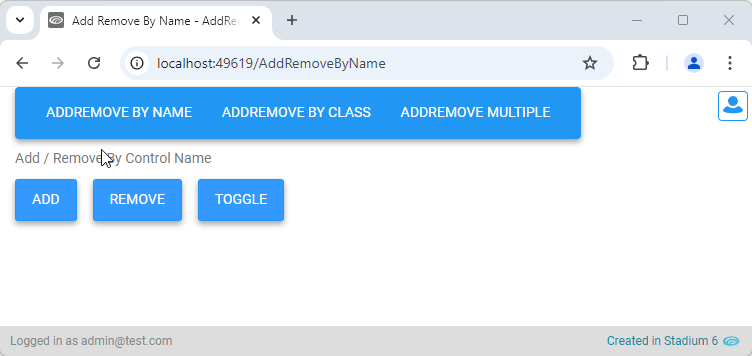

# Add / Remove Control Classes <!-- omit in toc -->

A utility to add / remove classes from the *Classes* property of controls. 



# Version
Initial 1.0

# Setup

## Application Setup
1. Check the *Enable Style Sheet* checkbox in the application properties

## Global Script
1. Create a Global Script called "AddRemoveClass"
2. Add the input parameters below to the Global Script
   1. Action
   2. StyleClass
   3. ControlName
   4. TargetClass
3. Drag a *JavaScript* action into the script
4. Add the Javascript below into the JavaScript code property
```javascript
/* Stadium Script v1.0 https://github.com/stadium-software/utils-add-remove-class  */
let scope = this;
let className = ~.Parameters.Input.StyleClass;
let elSelector = ~.Parameters.Input.TargetClass;
let elName = ~.Parameters.Input.ControlName;
let action = ~.Parameters.Input.Action;
if (action && ["add","remove"].includes(action.toLowerCase())) {
    action = action.toLowerCase();
} else {
    action = "toggle";
}
let getObjectName = (obj) => {
    let objname = obj.id.replace("-container","");
    do {
        let arrNameParts = objname.split(/_(.*)/s);
        objname = arrNameParts[1];
    } while ((objname.match(/_/g) || []).length > 0 && !scope[`${objname}Classes`]);
    return objname;
};
if (elName) {
    setDMValues(elName, "Classes", addRemoveClass(getDMValues(elName, "Classes")).join(" "));
} else if (elSelector) {
    setByClass("." + elSelector);
}
function setByClass(selector) {
    let targetEls = document.querySelectorAll(selector);
    for (let i=0;i<targetEls.length;i++) {
        let obname = getObjectName(targetEls[i]);
        let elClasses = getDMValues(obname, "Classes");
        if (elClasses) {
            setDMValues(obname, "Classes", addRemoveClass(elClasses).join(" "));
        }
    }
}
function addRemoveClass(elClasses) {
    let classesStr = elClasses || "";
    if (classesStr.indexOf(" ") > -1) {
        classesStr = elClasses.split(" ");
    } else {
        classesStr = [classesStr];
    }
    if (action == "remove") {
        classesStr.splice(classesStr.indexOf(className, 1));
    }
    if (action == "add") {
        classesStr.push(className);
    }
    if (action == "toggle") {
        if (classesStr.includes(className))  {
            classesStr.splice(classesStr.indexOf(className, 1));
        } else {
            classesStr.push(className);
        }
    }
    return classesStr;
}
function setDMValues(ob, property, value) {
    scope[`${ob}${property}`] = value;
}
function getDMValues(ob, property) {
    return scope[`${ob}${property}`];
}
```

## Page
1. Add a control to the page
2. Add a class if you wish to use the *TargetClass* option below

## Event Handler
1. Drag the "AddRemoveClass" script into the event handler
2. Complete the script input parameters
   1. Action: Add one  of these keywords
      1. add
      2. remove
      3. toggle (default)
   2. StyleClass: The class to be added / removed from the control
   3. Provide **one** of these (if both are provided the class will be ignored)
      1. ControlName: The value in the Control *Name* property in the Designer
      2. TargetClass: A class you added to one or more controls

## Stylesheet
1. Write some CSS for the class you entered in the "StyleClass" parameter above

## Working with Stadium Repos
Stadium Repos are not static. They change as additional features are added and bugs are fixed. Using the right method to work with Stadium Repos allows for upgrading them in a controlled manner. How to use and update application repos is described here 

[Working with Stadium Repos](https://github.com/stadium-software/samples-upgrading)